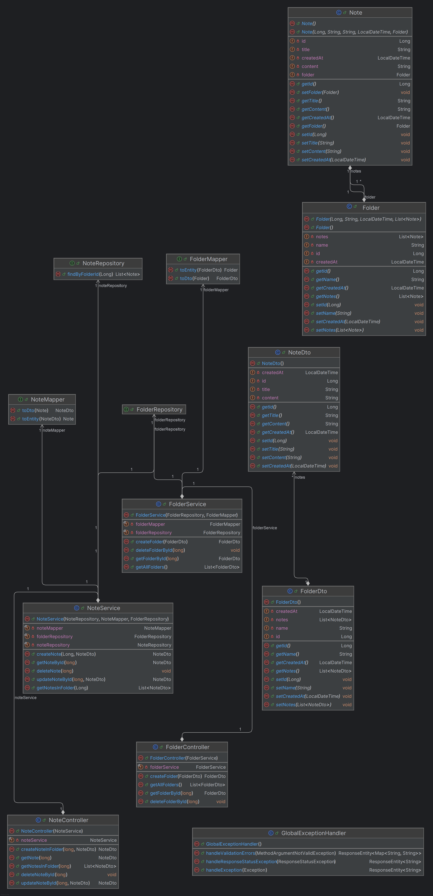

# Project Documentation – Notepad+++

This document contains the full documentation for the Notepad+++ application, created for modules **M294 (Frontend)** and **M295 (Backend)**.

---

## 1. Project Idea

### Overview
<!-- Short elevator pitch about what the app is and does -->

### Purpose
<!-- What problem does the app solve? Who benefits from it? -->

---

## 2. Requirements

### Functional Requirements
<!-- Features from the user's perspective -->

### Non-Functional Requirements
<!-- Performance, security, reliability etc. -->

---

## 3. Use Cases

### Use Case 1: Create Folder
- **Actor**: User
- **Preconditions**:
- **Steps**:
- **Expected Result**:

### Use Case 2: Add Note to Folder
- **Actor**:
- **Steps**:
- ...

<!-- Add more use cases as needed -->

---

## 4. Class Diagram

### Diagram

### Entities & Relationships
<!-- Brief explanation of entities and how they relate -->

---

## 5. REST API

### Overview
<!-- What resources are exposed and why -->

### Endpoints

| Method | Endpoint        | Description           | Request | Response |
|--------|-----------------|-----------------------|---------|----------|
| GET    | `/folders`      | List all folders      | –       | JSON     |
| POST   | `/folders`      | Create new folder     | JSON    | JSON     |
| ...    | ...             | ...                   | ...     | ...      |

### Data Models
<!-- DTOs, payload structures, etc. -->

---

## 6. Test Plan

### Environment
- Node.js / React
- Spring Boot
- MySQL (Docker)

### Test Cases

| Test ID | Description             | Expected Result | Status |
|---------|-------------------------|------------------|--------|
| TC01    | Create Folder           | Folder is saved  | ☐      |
| TC02    | Delete Note             | Note is removed  | ☐      |
| ...     | ...                     | ...              | ☐      |

### Summary
<!-- Overall test results -->

---

## 7. Installation Instructions

### Backend Setup

**Requirements:**
- Java 17+
- Maven
- Docker & Docker Compose

**Steps:**
1. Clone the repo
2. Run MySQL container
3. Run the Spring Boot application

### Frontend Setup

**Requirements:**
- Node.js
- npm

**Steps:**
1. `cd frontend/`
2. `npm install`
3. `npm run dev`

---

## 8. Support Log

### Peer Help
<!-- Record help from classmates -->

### Online Resources
<!-- List of links, StackOverflow posts, docs -->

### Instructor Feedback
<!-- Notes from meetings or approvals -->
